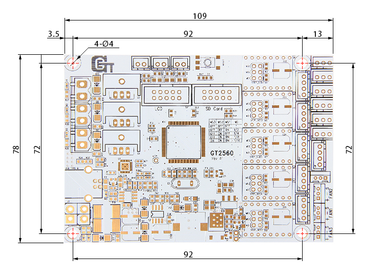
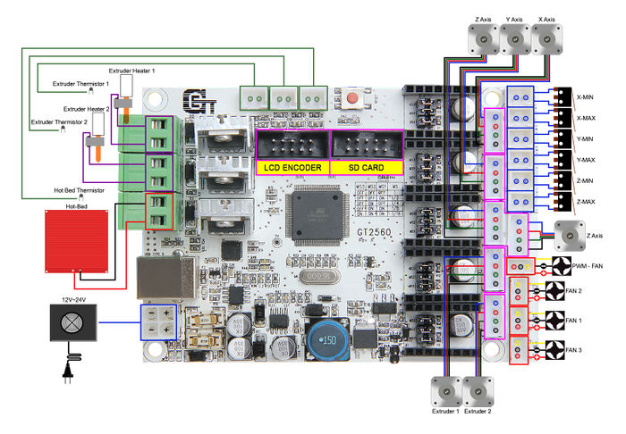
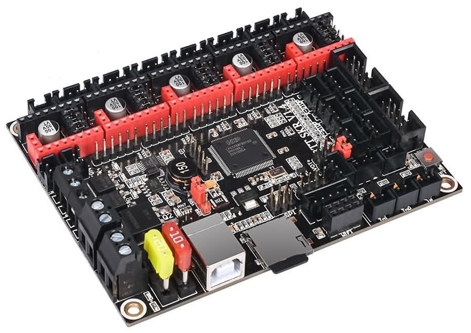

# GT 2560

## Link:

Jeg har to Controller som jeg kan bruge i dette project
* GeeeTech 
  * 
  * 
  * [GT2560 Manual](https://www.geeetech.com/wiki/index.php/GT2560)
  * [Link til GT2560 page](https://www.geeetech.com/wiki/index.php/GT2560#Get_Started)
  * [www.geeetech.com](https://www.geeetech.com/forum/viewtopic.php?f=20&t=17046)
* BigTreeTech 
  * [github.com/bigtreetech - BTT SKR V1.4](https://github.com/bigtreetech/BIGTREETECH-SKR-V1.3/tree/master/BTT%20SKR%20V1.4)

## Youtube Guide 

* [Chris Riley](https://www.youtube.com/c/ChrisRiley)
  * [Marlin 2.0 On 8-Bit Boards - Upgrade - CR10 - VSCode - Chris's Basement](https://www.youtube.com/watch?v=Ib188-ACa08)
  * [3D Printer Fix Up - Geeetech Pro B](https://www.youtube.com/c/ChrisRiley/search?query=Geeetech%20Pro)
* TOM's Guide
  * [Firmware Basics](https://www.youtube.com/watch?v=3gwWVFtdg-4)
  * [Understanding steps per millimeter and using Prusa's calculator](https://www.youtube.com/watch?v=VIHgDiCCY0Y)
  * [Calibrating your extruder](https://www.youtube.com/watch?v=YUPfBJz3I6Y)
  * [Using Marlin's PID autotune](https://www.youtube.com/watch?v=APzJfYAgFkQ)

## Marlin Firmware

* [Marlin Firmware, The code that makes the things](https://marlinfw.org/)
  * [Learn More - What is Marlin, and how does it work?](https://marlinfw.org/docs/basics/introduction.html)
  * [Marlin on Github - Contribute to our ever expanding open source Marlin project on GitHub!](https://github.com/MarlinFirmware/Marlin)
  * [MarlinFirmware/Configurations](https://github.com/MarlinFirmware/Configurations)
  * [Auto Build Marlin](https://marlinfw.org/docs/basics/auto_build_marlin.html)

## MPCNC Lowrider
* [3D Print your own CNC - MPCNC Lowrider2 part 1](https://www.youtube.com/watch?v=xIGre_E2_og&list=PLGqRUdq5ULsOmwU4uSw8GAl9m7saaeuUS&index=1)
* [MPCNC Lowrider part 2 - belts, wiring, firmware: Ramps + SKR V1.3, TMC5160 & touch screen](https://www.youtube.com/watch?v=Vljd9lJXu0E&list=PLGqRUdq5ULsOmwU4uSw8GAl9m7saaeuUS&index=2)
* [MPCNC Lowrider part 3 - Router, spoil board and cutting stuff!](https://www.youtube.com/watch?v=R7Tk6wY_9ms&list=PLGqRUdq5ULsOmwU4uSw8GAl9m7saaeuUS&index=3)
* [Rat Rig V-core 3 part 1 - Premium coreXY 3D printer community build](https://www.youtube.com/watch?v=XoTxFs3BGuk&list=PLGqRUdq5ULsOmwU4uSw8GAl9m7saaeuUS&index=4)
* [3D printed large CNC: Lowrider2 upgrades](https://www.youtube.com/watch?v=XsEho_zTU_8&list=PLGqRUdq5ULsOmwU4uSw8GAl9m7saaeuUS&index=5)
