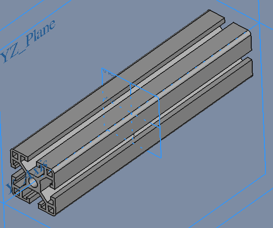
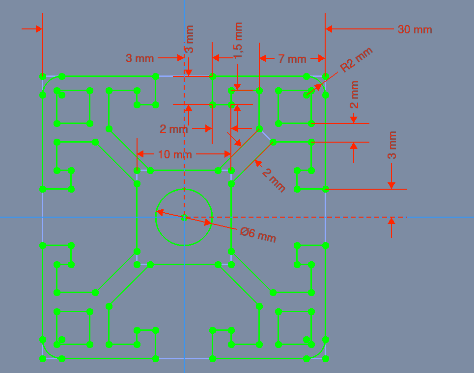

# AluProfile

## Slut Resultat

| File   | X_Axis-Mount |
| ---    | ---           |
|FreeCAD |[AluProfil_30x30x150.FCStd](./AluProfil_30x30x150.FCStd)|
| STL    |[AluProfil_30x30x150-Body.stl](./stl/AluProfil_30x30x150-Body.stl)|

## Sketch

* Sketch
  * Support: XZ_Plane
  * Map Mode: FlatFace
  * Map Reversed: false
  * Attachment Offset
    * Angle: 0,00°
    * Axis: [X: 0,00 Y: 0,00 z: 1,00]
    * Position: (x: 0,00 mm, y: 0,00 mm, z: 0,00 mm)

### Pad

* Pad
  * Type: Length
    * Length: 150,00 mm
    * Midplane: true
    * Reversed: false
    * Alow Multi Face: true

