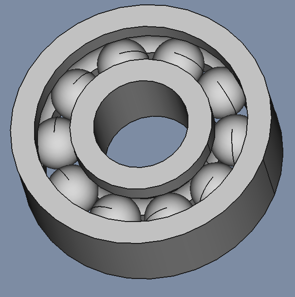
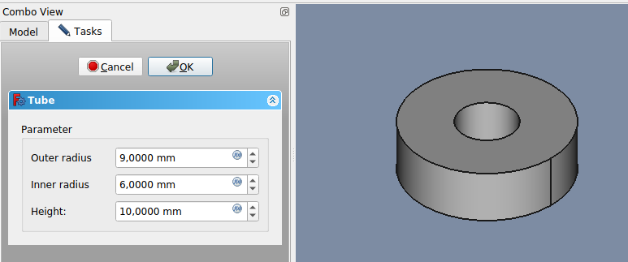
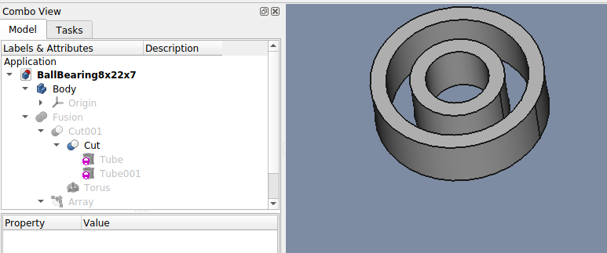
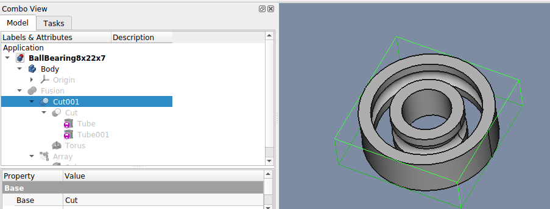
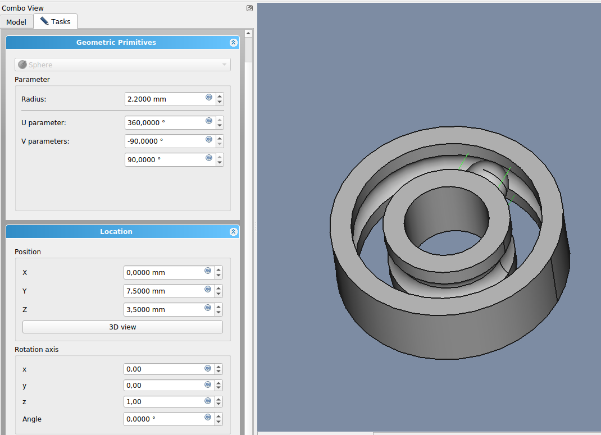
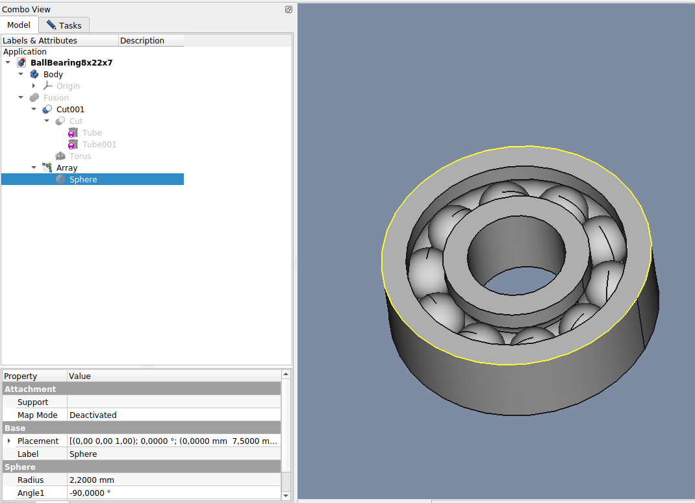
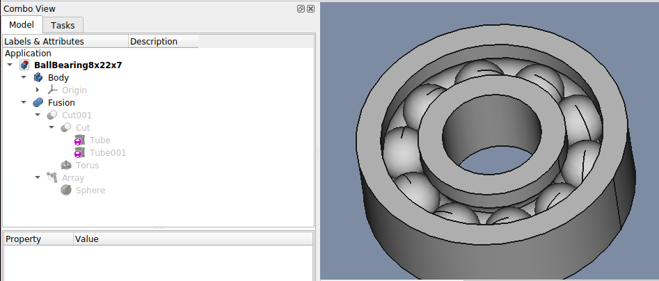

# Kuglelejer

## Se video her [https://www.youtube.com/watch?v=vb1Jp4uh06Q](https://www.youtube.com/watch?v=vb1Jp4uh06Q)

## Slut Resultat

|

| File   | X_Axis-Mount |
| ---    | ---           |
|FreeCAD |[Kugleleje_8x22x7](./BallBearing8x22x7.FCStd)|

## Tube

* Base
  * Position: [x: 0,00 Y: 0,00 z: 0,00]  
* Tube
  * Outer radius: 11 mm
  * Inner radius: 4 mm
  * Height: 7 mm

## Tube001

* Base
  * Position: [x: 0,00 Y: 0,00 z: -2,00]  
* Tube
  * Outer radius: 9 mm
  * Inner radius: 6 mm
  * Height: 10 mm

## Cut

* Base
  * Position: [x: 0,00 Y: 0,00 z: 0,00]  

## Torus

* Base
  * Position: [x: 0,00 Y: 0,00 z: 3,50]  
* Torus
  * Radius1: 7,50 mm
  * Radius2: 2,25 mm
  * Angle1: -180,0 °
  * Angle2: 180,0 °
  * Angle3: 360,0 °

## Cut001

* Base
  * Position: [x: 0,00 Y: 0,00 z: 0,00]  

## Sphere

## Array

## Fusion

