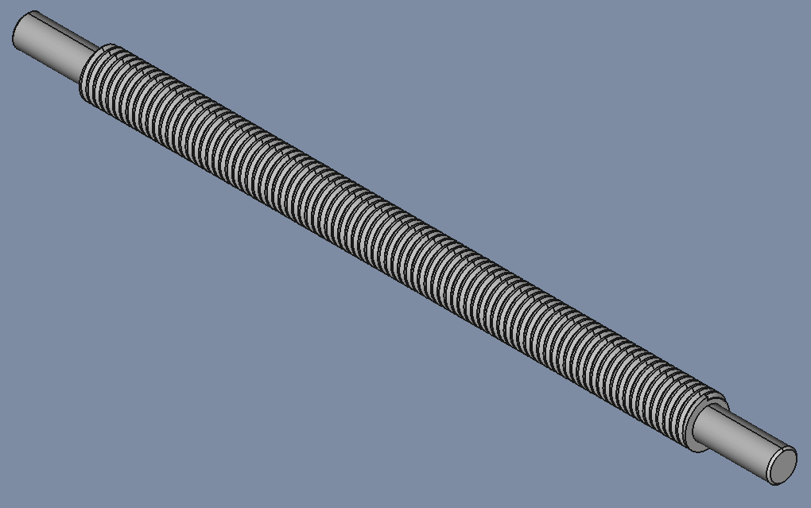
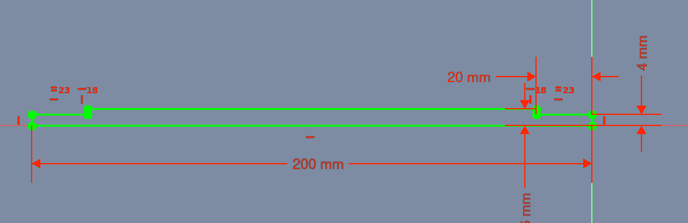
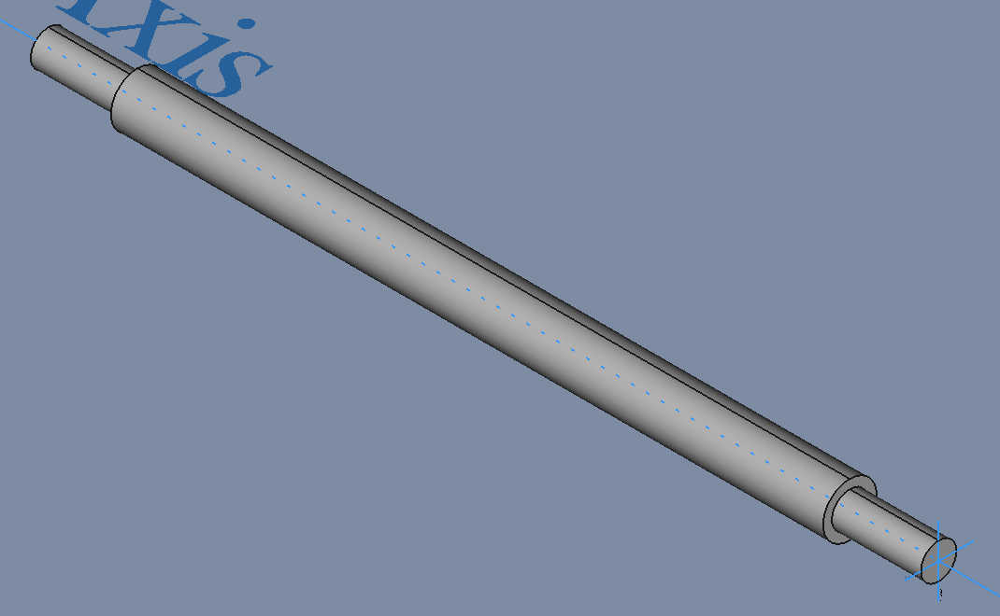
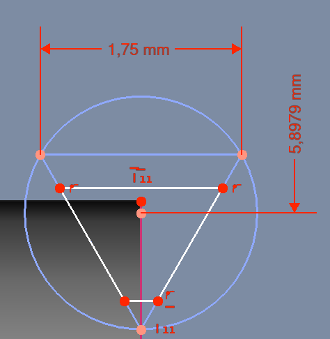
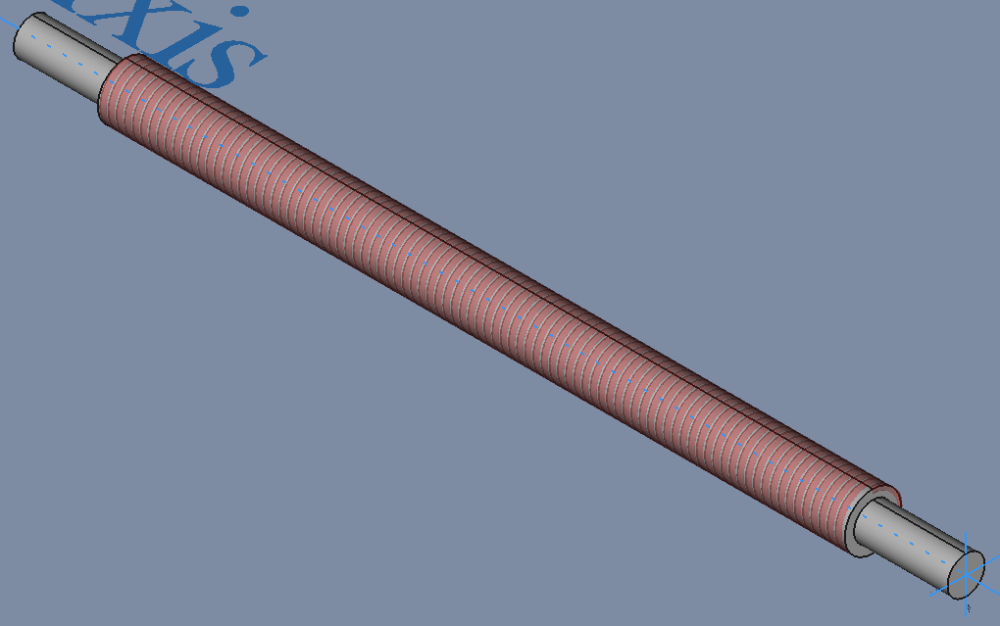

# Gevinstang

## Slut Resultat

| File   | X_Axis-Mount |
| ---    | ---           |
|FreeCAD |[gevinstang.FCStd](./gevinstang.FCStd)|

## Sketch

* Sketch
  * Support: XZ_Plane
  * Map Mode: FlatFace
  * Map Reversed: false
  * Attachment Offset
    * Angle: 0,00°
    * Axis: [X: 0,00 Y: 0,00 z: 1,00]
    * Position: (x: 0,00 mm, y: 0,00 mm, z: 0,00 mm)

### Revolution

* Revolution
  * Base (x: 0,00 Y: 0,00 z: 0,00)
  * Axis (x: 1,00 Y: 0,00 z: 0,00)
  * Angle: 360°
  * Reference Axis: X_Axis
    * Midplane: false
    * Reversed: false
    * Alow Multi Face: true

## Sketch001

* Sketch
  * Support: XZ_Plane
  * Map Mode: FlatFace
  * Map Reversed: false
  * Attachment Offset
    * Angle: 0,00°
    * Axis: [X: 0,00 Y: 0,00 z: 1,00]
    * Position: (x: 0,00 mm, y: 0,00 mm, z: 0,00 mm)

### SubtractiveHelix

* SubtractiveHelix
  * Status:
    * Axis: Base X axis
    * Mode: Pitch-Hight-Angle
    * Pitch: 1,75 mm
    * Height: 160 mm
    * Cone angle: 0,00°
    * Left handed: false
    * Reversed: true
    * Remove outside of profile: false
    * Update view: true

## Chamfer

* Chamfer
  * Chamfer Type: Equal distance
  * Size: 0,5 mm
  * Angle: 45,0°
  * Used All Edges: false
