# X_Axis-Mount

## Slut Resultat

| Front | Back |
| --- | --- |
|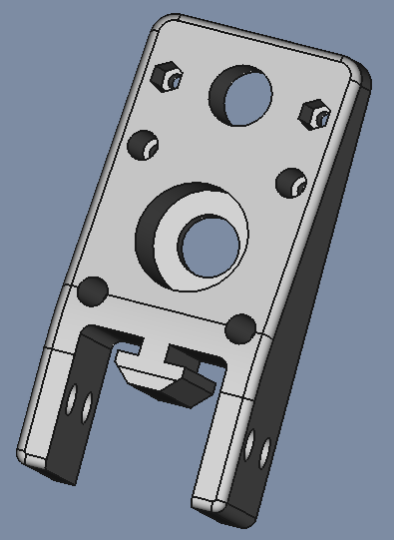|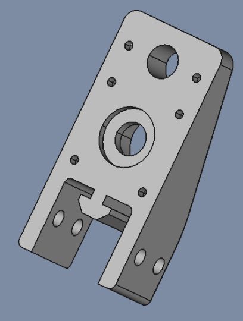|

| File   | X_Axis-Mount |
| ---    | ---           |
|FreeCAD |[X_Axis-Mount.FCStd](./X_Axis-Mount.FCStd)|
| STL    |[X_Axis-Mount-Body-Leje-Motor.stl](./stl/X_Axis-Mount-Body-Leje-Motor.stl)|

## Sketch

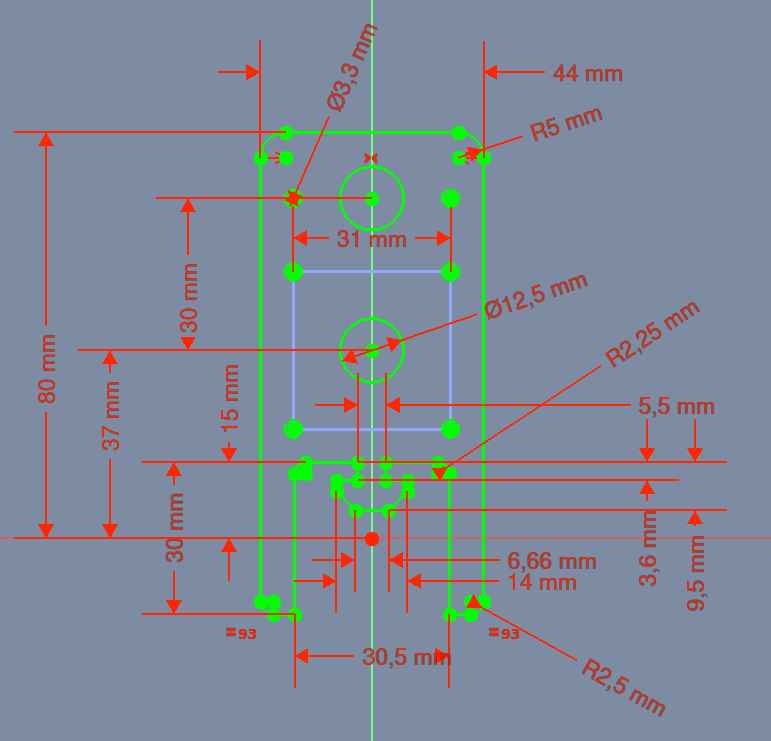

* Sketch
  * Support: XY_Plane
  * Map Mode: FlatFace
  * Map Reversed: false
  * Attachment Offset
    * Angle: 0,00°
    * Axis: [X: 0,00 Y: 0,00 z: 1,00]
    * Position: (x: 0,00 mm, y: 0,00 mm, z: 0,00 mm)

### Pad

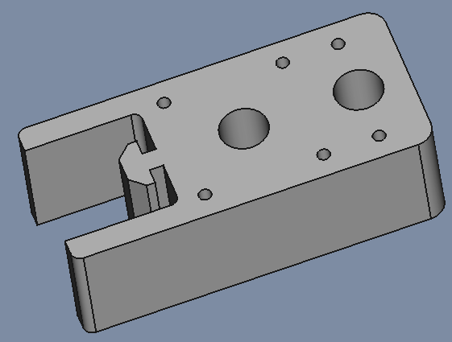

* Pad
  * Type: Length
    * Length: 30,00 mm
    * Midplane: false
    * Reversed: false
    * Alow Multi Face: true

* Pad
  * Type: Length
    * Length 30,00 mm

## Sketch001

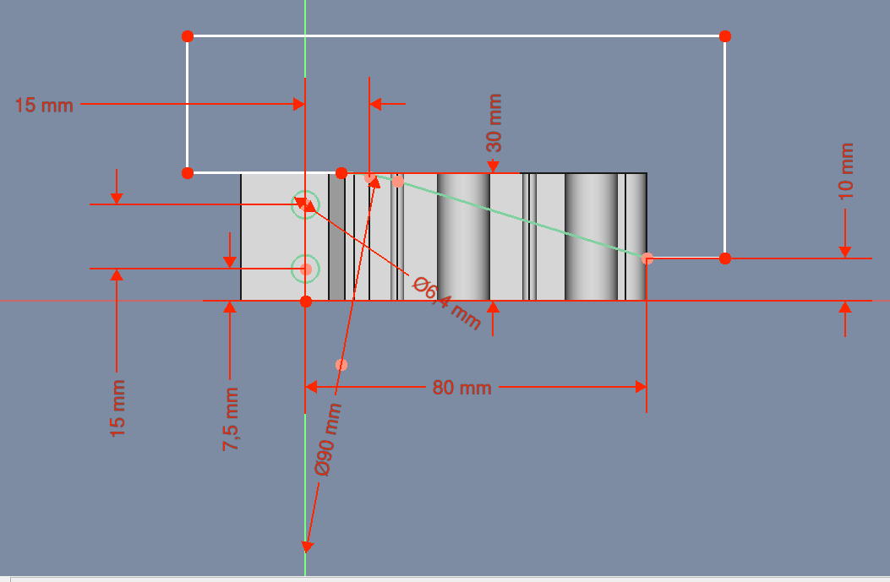

* Sketch
  * Support: XZ_Plane
  * Map Mode: FlatFace
  * Map Reversed: false
  * Attachment Offset
    * Angle: 0,00°
    * Axis: [X: 0,00 Y: 0,00 z: 1,00]
    * Position: (x: 0,00 mm, y: 0,00 mm, z: 0,00 mm)

### Pocket006

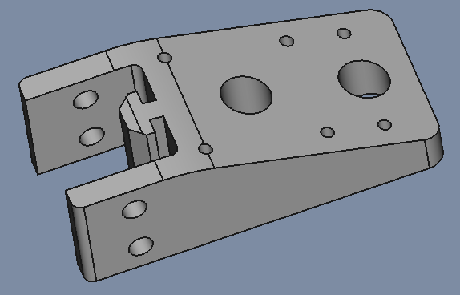

* Pocket
  * Type: ThroughAll
  * Midplane: true
  * Reversed: false
  * Alow Multi Face: true

## Sketch002 - for M3 umbraco skruehoved

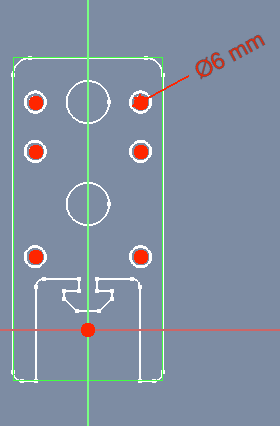

* Sketch
  * Support: XY_Plane
  * Map Mode: FlatFace
  * Map Reversed: false
  * Attachment Offset
    * Angle: 0,00°
    * Axis: [X: 0,00 Y: 0,00 z: 1,00]
    * Position: (x: 0,00 mm, y: 0,00 mm, z: 4,00 mm)

### Pocket006

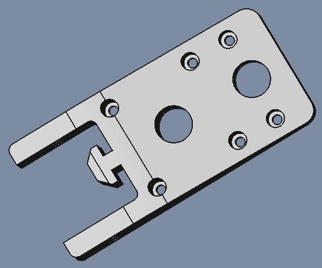

* Pocket
  * Type: ThroughAll
  * Midplane: false
  * Reversed: true
  * Alow Multi Face: true

## Sketch003 - for fordybning for motor mount

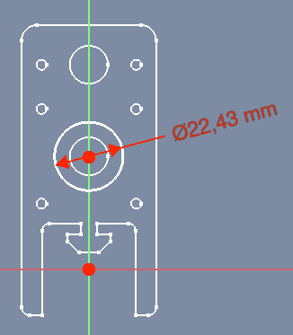

* Sketch
  * Support: XY_Plane
  * Map Mode: FlatFace
  * Map Reversed: false
  * Attachment Offset
    * Angle: 0,00°
    * Axis: [X: 0,00 Y: 0,00 z: 1,00]
    * Position: (x: 0,00 mm, y: 0,00 mm, z: 3,00 mm)

### Pocket007

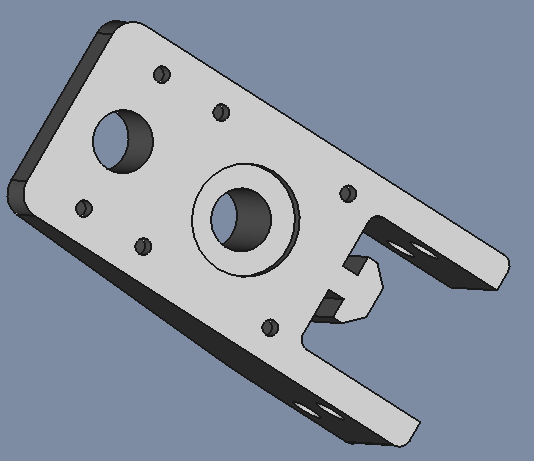

* Pocket
  * Type: ThroughAll
  * Midplane: false
  * Reversed: false
  * Alow Multi Face: true

## Sketch008 - fordybning til RASK Kuglelejer ABEC-9 8x22x7 mm

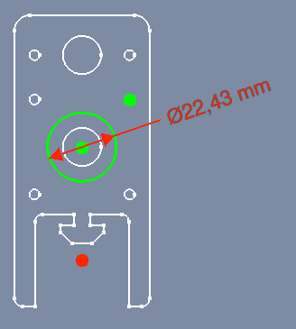

* Sketch
  * Support: XY_Plane
  * Map Mode: FlatFace
  * Map Reversed: false
  * Attachment Offset
    * Angle: 0,00°
    * Axis: [X: 0,00 Y: 0,00 z: 1,00]
    * Position: (x: 0,00 mm, y: 0,00 mm, z: 7,00 mm)

### Pocket008-Ballbearing

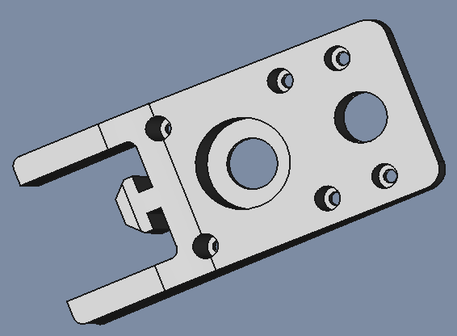

* Pocket
  * Type: ThroughAll
  * Midplane: false
  * Reversed: true
  * Alow Multi Face: true

## Fillet

* Fillet
  * Radius: 2,00 mm
  * Use All Edges: false
