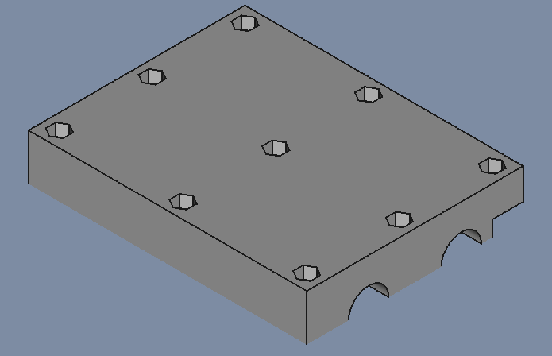
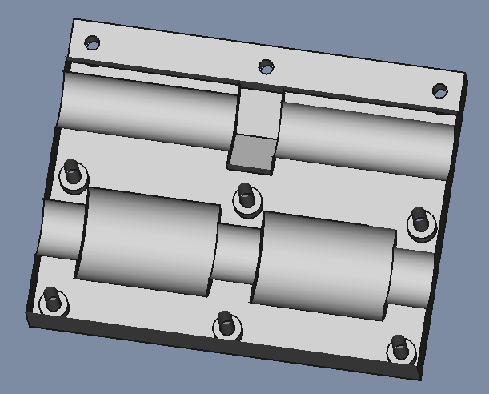
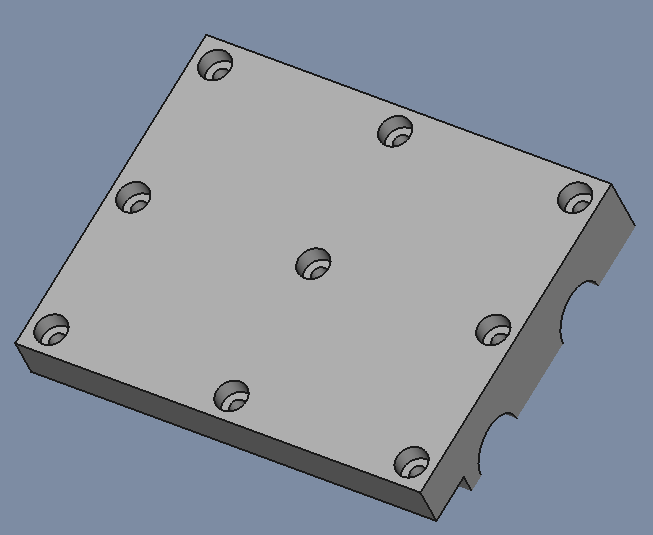
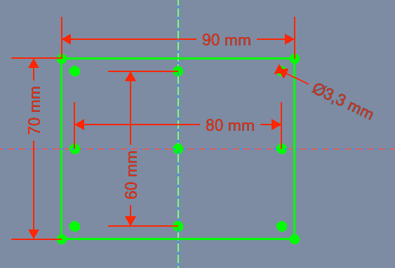
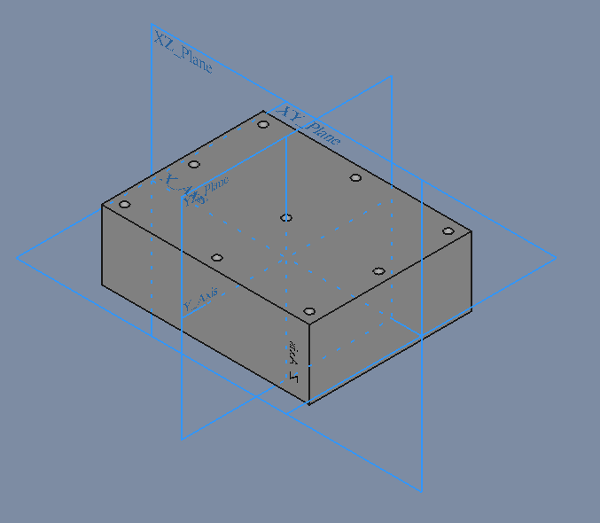
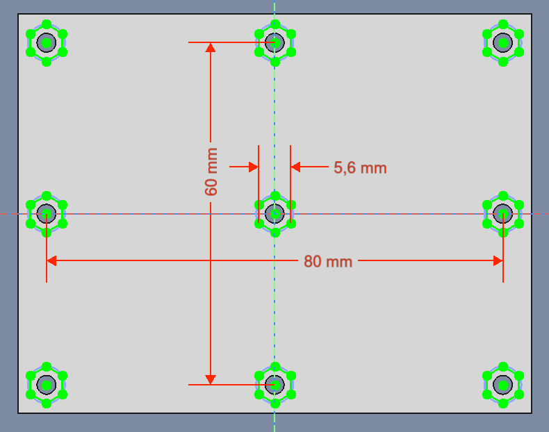
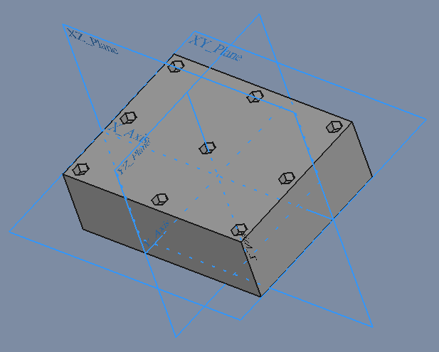
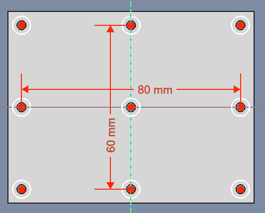
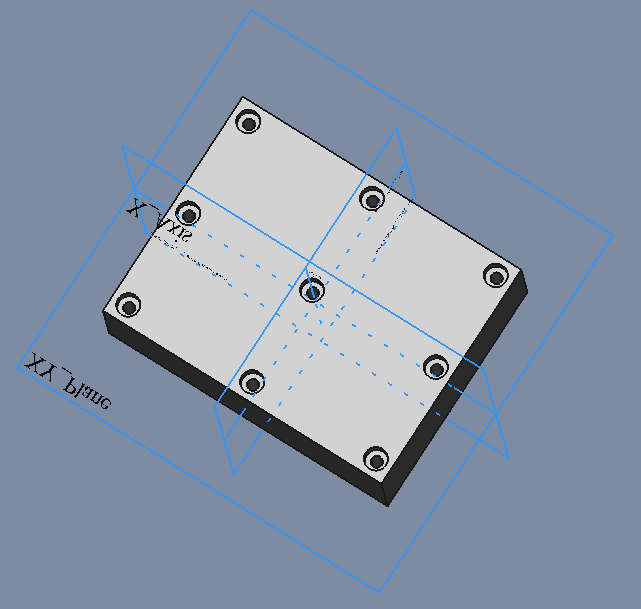
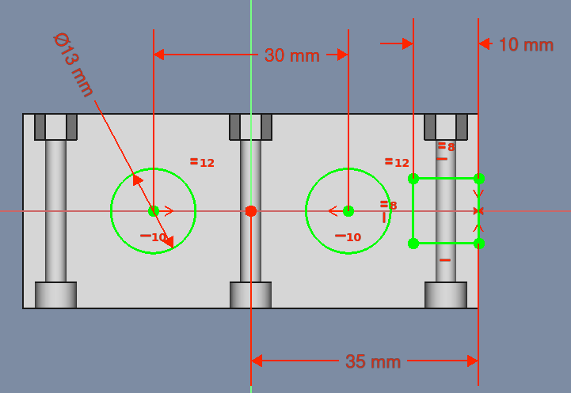

# X_Axis-Sled-004

## Slut Resultat

| InsidePart | Midle | Outsidepart |
| --- | --- | --- |
||||

| File   | X_Axis-Sled | X_Axis-Sled-InsidePart | X_Axis-Sled-OutsidePart |
| ---    | ---           | ---           |
|FreeCAD |[X_Axis-Slade-004.FCStd](./CNC-Slade-004.FCStd)| | |
| STL    | |[X_Axis-Slade-004-Inside.stl.stl](./stl/CNC-Slade-004-Inside.stl)|[X_Axis-Slade-004-Outside.stl](./stl/CNC-Slade-004-Outside.stl)|

## Sketch

* Attachment
  * Support: XY_Plane
  * Map Mode: FlatFace
  * Map Reversed: false
  * Attachment Offset
    * Angle: 0,00°
    * Axis: [X: 0,00 Y: 0,00 z: 1,00]
    * Position: (x: 0,00 mm, y: 0,00 mm, z: 0,00 mm)

### Pad

* Pad
  * Type: Length
    * Length: 30,00 mm
*Sketch Based  
    * Midplane: true
    * Reversed: false
    * Alow Multi Face: true

* Pad
  * Type: Length
    * Length 30,00 mm

## Sketch001

* Sketch
  * Support: XY_Plane
  * Map Mode: FlatFace
  * Map Reversed: false
  * Attachment Offset
    * Angle: 0,00°
    * Axis: [X: 0,00 Y: 0,00 z: 1,00]
    * Position: (x: 0,00 mm, y: 0,00 mm, z: 15,00 mm)

### Pocket

* Pocket
  * Type: Length
  * length: 4
* Sketch Based
  * Midplane: false
  * Reversed: false
  * Alow Multi Face: true

## Sketch002

* Sketch
  * Support: XY_Plane
  * Map Mode: FlatFace
  * Map Reversed: false
  * Attachment Offset
    * Angle: 0,00°
    * Axis: [X: 0,00 Y: 0,00 z: 1,00]
    * Position: (x: 0,00 mm, y: 0,00 mm, z: -15,00 mm)

### Pocket001

* Pocket
  * Type: 
  * Length: 4,00 mm
*Sketch Based  
  * Midplane: false
  * Reversed: true
  * Alow Multi Face: true

## Sketch003

* Sketch
  * Support: XY_Plane
  * Map Mode: FlatFace
  * Map Reversed: false
  * Attachment Offset
    * Angle: 0,00°
    * Axis: [X: 0,00 Y: 0,00 z: 1,00]
    * Position: (x: 0,00 mm, y: 0,00 mm, z: 3,00 mm)

### Pocket002

* Pocket
  * Type: ThroughAll
  * Midplane: false
  * Reversed: false
  * Alow Multi Face: true

## Sketch004

* Sketch
  * Support: XY_Plane
  * Map Mode: FlatFace
  * Map Reversed: false
  * Attachment Offset
    * Angle: 0,00°
    * Axis: [X: 0,00 Y: 0,00 z: 1,00]
    * Position: (x: 0,00 mm, y: 0,00 mm, z: 7,00 mm)

### Pocket003

* Pocket
  * Type: ThroughAll
  * Midplane: false
  * Reversed: true
  * Alow Multi Face: true

