# X_Axis-Sled

## Box

### Box Slut Resultat

| InsidePart | Center Cut | Outsidepart |
| --- | --- | --- |
|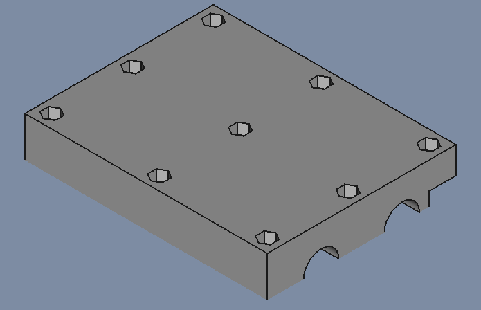|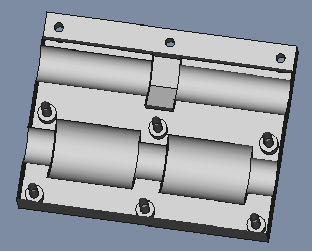|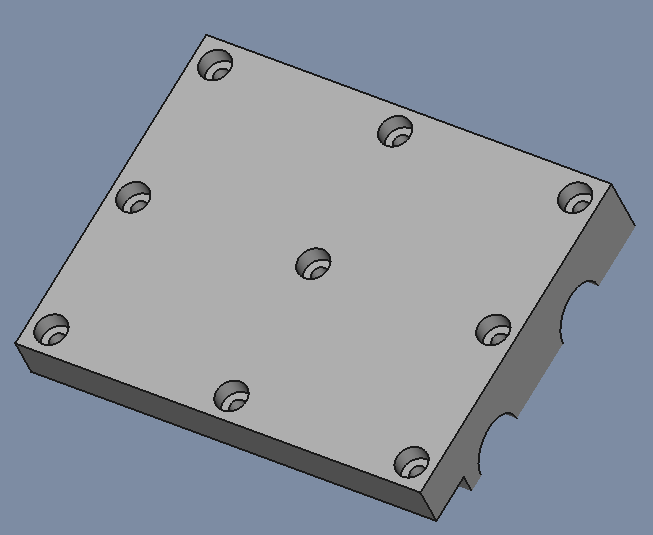|

| File   | X_Axis-Sled | X_Axis-Sled-InsidePart | X_Axis-Sled-OutsidePart |
| ---    | ---           | ---           |
|FreeCAD |[X_Axis-Slade-004.FCStd](./X-Axis-Slade-004.FCStd)| | |
| STL    | |[X_Axis-Slade-004-Inside.stl.stl](./stl/CNC-Slade-004-Inside.stl)|[X_Axis-Slade-004-Outside.stl](./stl/CNC-Slade-004-Outside.stl)|

### Sketch

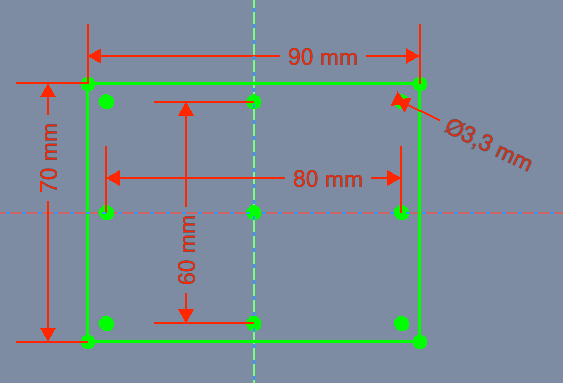

* Attachment
  * Support: XY_Plane
  * Map Mode: FlatFace
  * Map Reversed: false
  * Attachment Offset
    * Angle: 0,00°
    * Axis: [X: 0,00 Y: 0,00 z: 1,00]
    * Position: (x: 0,00 mm, y: 0,00 mm, z: 0,00 mm)

### Pad

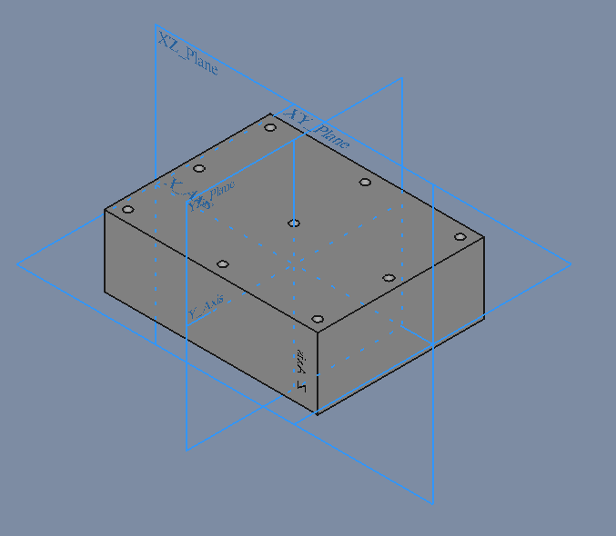

* Pad
  * Type: Length
    * Length: 30,00 mm
*Sketch Based  
    * Midplane: true
    * Reversed: false
    * Alow Multi Face: true

* Pad
  * Type: Length
    * Length 30,00 mm

### Sketch001

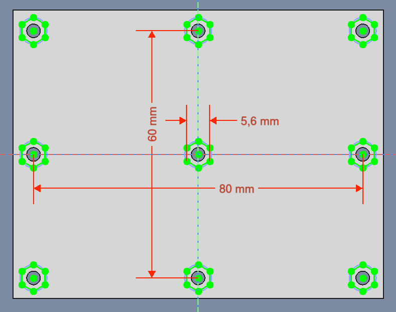

* Sketch
  * Support: XY_Plane
  * Map Mode: FlatFace
  * Map Reversed: false
  * Attachment Offset
    * Angle: 0,00°
    * Axis: [X: 0,00 Y: 0,00 z: 1,00]
    * Position: (x: 0,00 mm, y: 0,00 mm, z: 15,00 mm)

### Pocket

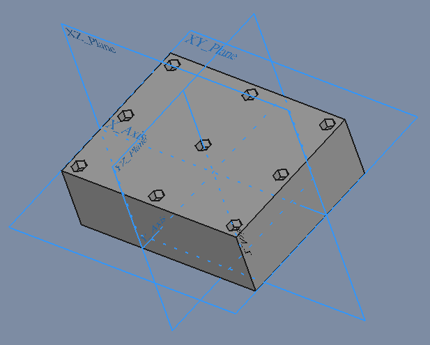

* Pocket
  * Type: Length
  * length: 4
* Sketch Based
  * Midplane: false
  * Reversed: false
  * Alow Multi Face: true

### Sketch002

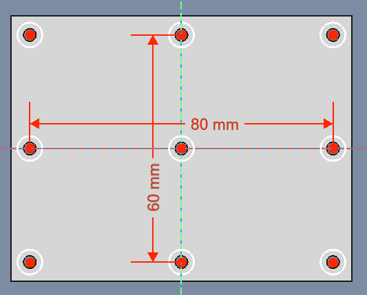

* Sketch
  * Support: XY_Plane
  * Map Mode: FlatFace
  * Map Reversed: false
  * Attachment Offset
    * Angle: 0,00°
    * Axis: [X: 0,00 Y: 0,00 z: 1,00]
    * Position: (x: 0,00 mm, y: 0,00 mm, z: -15,00 mm)

### Pocket001

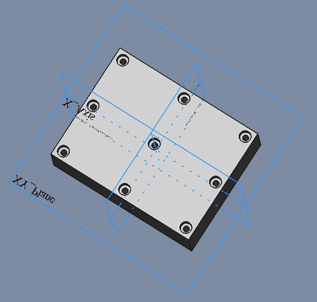

* Pocket
  * Type: Length
  * Length: 4,00 mm
* Sketch Based  
  * Midplane: false
  * Reversed: true
  * Alow Multi Face: true

### Sketch003

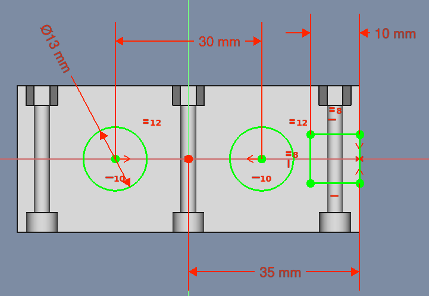

* Sketch
  * Support: YZ_Plane
  * Map Mode: FlatFace
  * Map Reversed: false
  * Attachment Offset
    * Angle: 0,00°
    * Axis: [X: 0,00 Y: 0,00 z: 1,00]
    * Position: (x: 0,00 mm, y: 0,00 mm, z: 0,00 mm)

### Pocket002

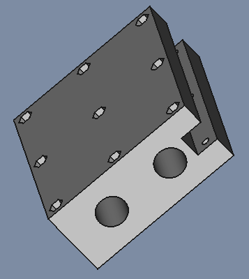

* Pocket
  * Type: ThroughAll
* Sketch Based
  * Midplane: true
  * Reversed: false
  * Alow Multi Face: true

### Sketch004

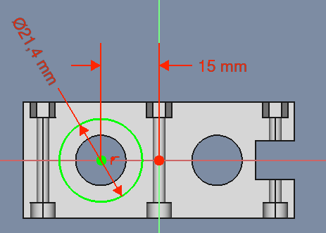

* Sketch
  * Support: YZ_Plane
  * Map Mode: FlatFace
  * Map Reversed: false
  * Attachment Offset
    * Angle: 0,00°
    * Axis: [X: 0,00 Y: 0,00 z: 1,00]
    * Position: (x: 0,00 mm, y: 0,00 mm, z: 5,00 mm)

### Pocket003

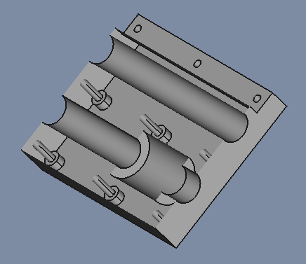

* Pocket
  * Type: Length
  * Length: 30,40  mm
* Sketch Based
  * Midplane: false
  * Reversed: true
  * Alow Multi Face: true

### Sketch005

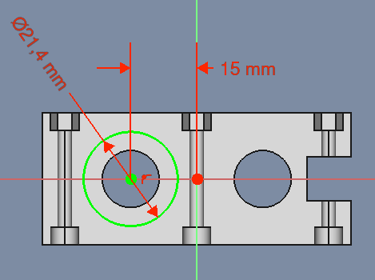

* Sketch
  * Support: YZ_Plane
  * Map Mode: FlatFace
  * Map Reversed: false
  * Attachment Offset
    * Angle: 0,00°
    * Axis: [X: 0,00 Y: 0,00 z: 1,00]
    * Position: (x: 0,00 mm, y: 0,00 mm, z: -5,00 mm)

### Pocket004

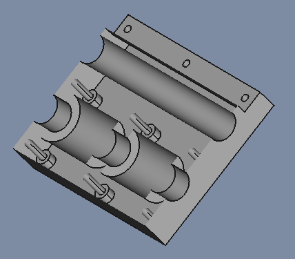

* Pocket
  * Type: Length
  * Length: 30,40  mm
* Sketch Based
  * Midplane: false
  * Reversed: false
  * Alow Multi Face: true

### Sketch006

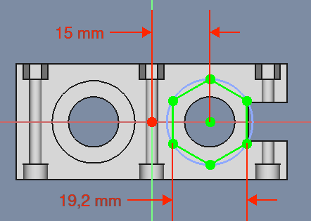

* Sketch
  * Support: YZ_Plane
  * Map Mode: FlatFace
  * Map Reversed: false
  * Attachment Offset
    * Angle: 0,00°
    * Axis: [X: 0,00 Y: 0,00 z: 1,00]
    * Position: (x: 0,00 mm, y: 0,00 mm, z: 0,00 mm)

### Pocket005

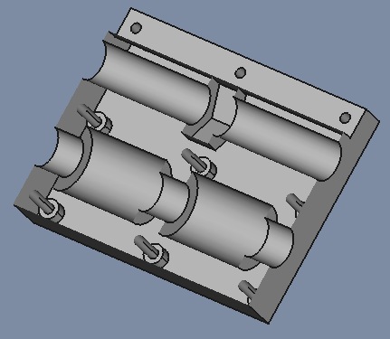

* Pocket
  * Type: Length
  * Length: 10,10  mm
* Sketch Based
  * Midplane: true
  * Reversed: true
  * Alow Multi Face: true

## X_Axis-SledGuide

### Guide Slut Resultat

| InsidePart |
| --- |
|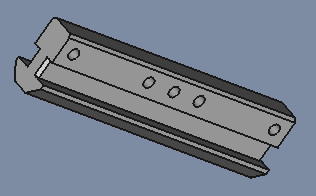|

| File   | X_Axis- |
| ---    | ---     |
 |FreeCAD |[X_Axis-Slade](./X-Axis-Slade-004.FCStd)|
| STL    | [X_Axis-Slade](./stl/CNC-Slade-005-Guide.stl)

### Sketch007

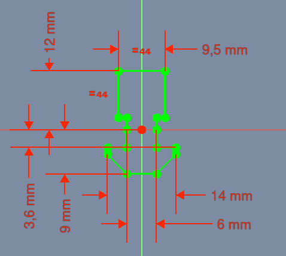

* Attachment
  * Support: XY_Plane001
  * Map Mode: FlatFace
  * Map Reversed: false
  * Attachment Offset
    * Angle: 0,00°
    * Axis: [X: 0,00 Y: 0,00 z: 1,00]
    * Position: (x: 0,00 mm, y: 0,00 mm, z: 0,00 mm)

### Pad001

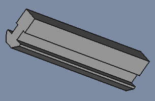

* Pad
  * Type: Length
    * Length: 90,00 mm
* Sketch Based  
  * Midplane: false
  * Reversed: false
  * Alow Multi Face: true

### Sketch008

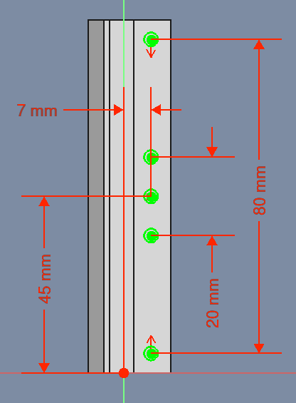

* Sketch
  * Support: XZ_Plane001
  * Map Mode: FlatFace
  * Map Reversed: false
  * Attachment Offset
    * Angle: 0,00°
    * Axis: [X: 0,00 Y: 0,00 z: 1,00]
    * Position: (x: 0,00 mm, y: 0,00 mm, z: 15,00 mm)

### Pocket006

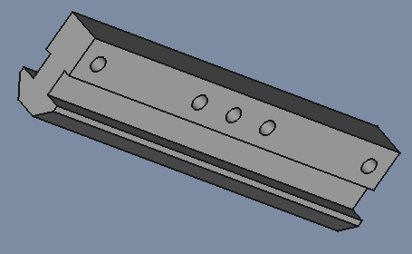

* Pocket
  * Type: ThroughAll
* Sketch Based
  * Midplane: true
  * Reversed: false
  * Alow Multi Face: true

### Chamfer

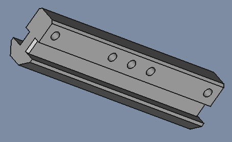

* Chamfer
  * Chamfer Type: Equal distance
  * Size: 1,00 mm
  * Angle: 45,00°
  * Use All Edges: false
