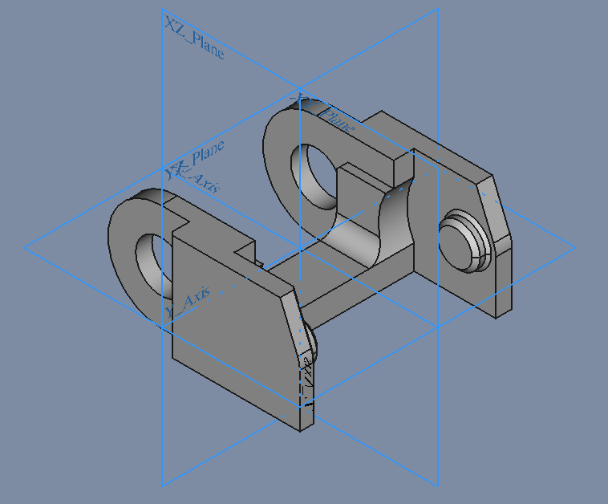
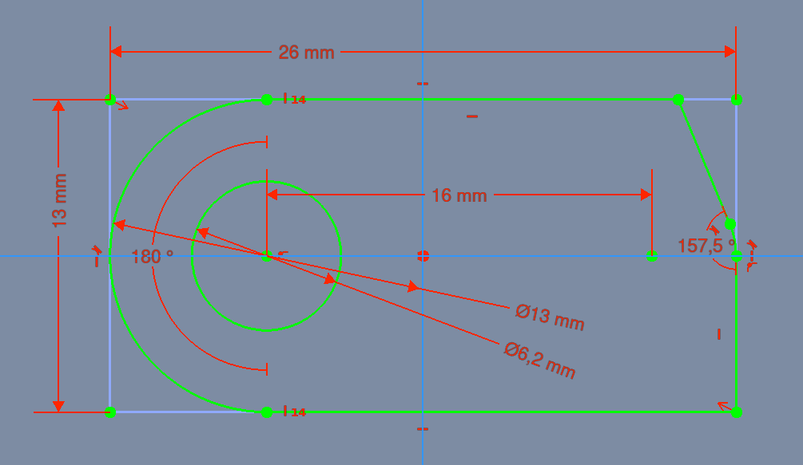
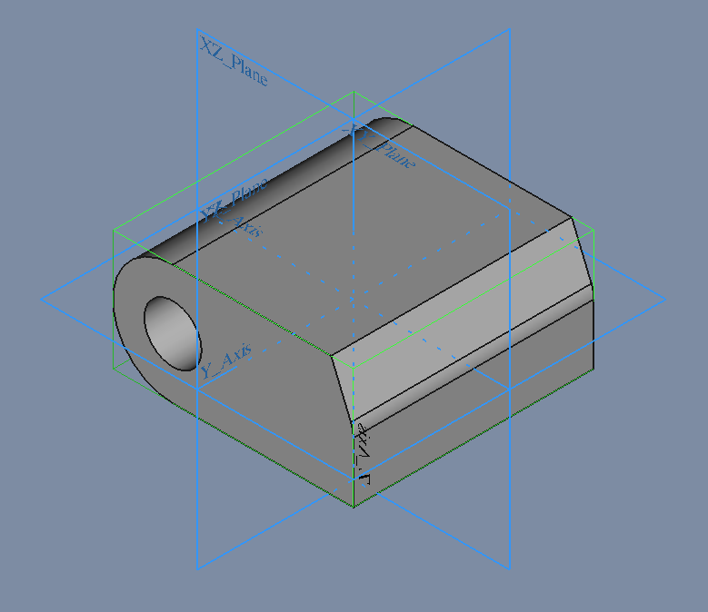
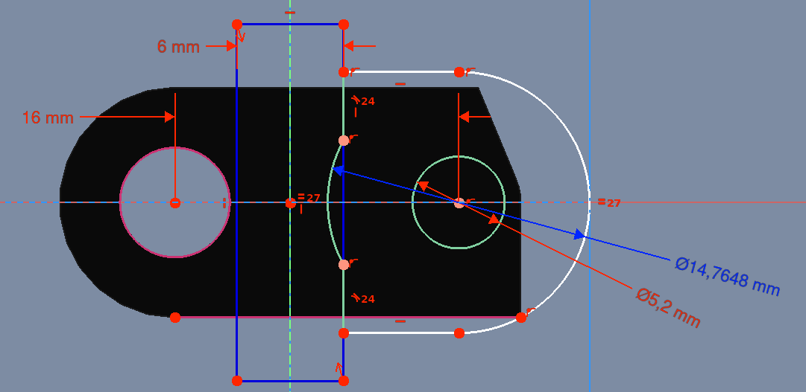
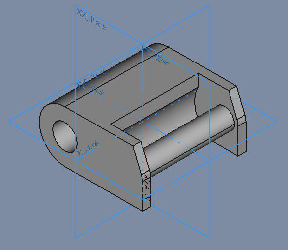
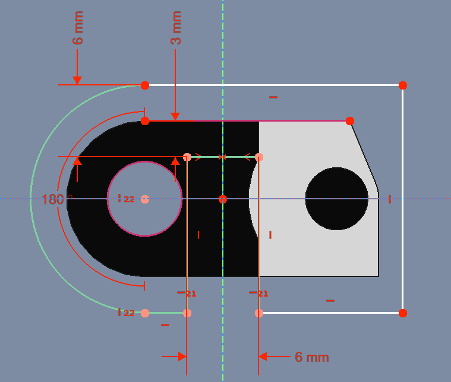
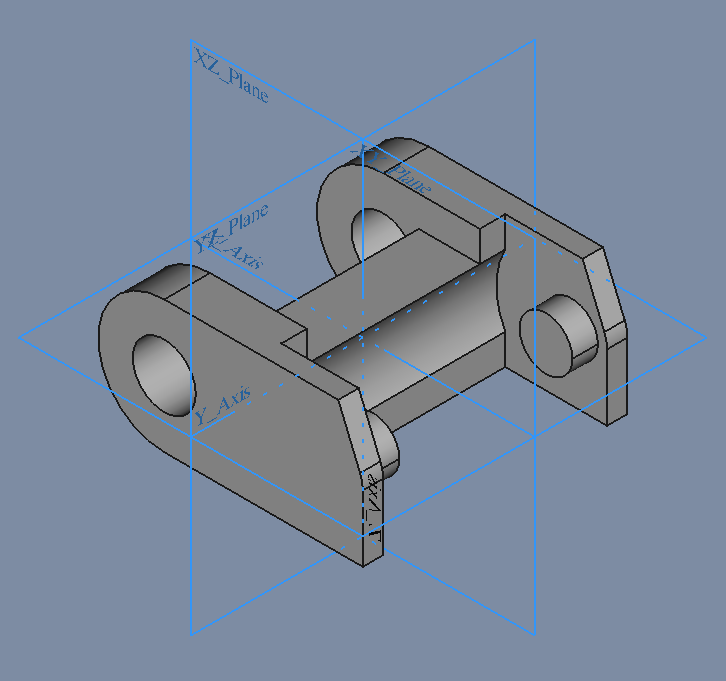
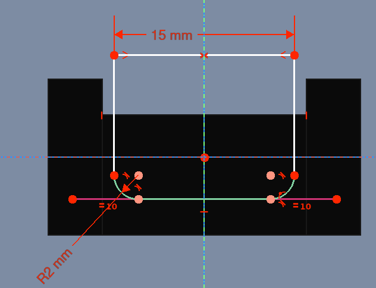
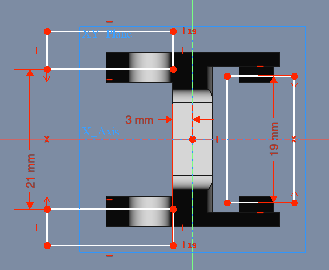
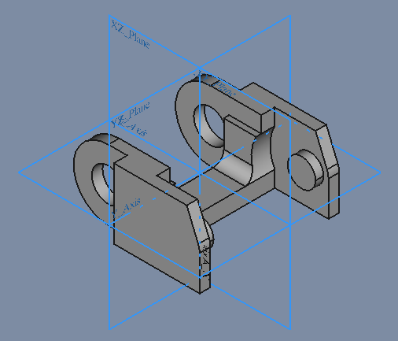

# DragChain Bund & Top

## DragThain_Bund

### 1. Sketch

* Sketch
  * Support: XZ_Plane
  * Attachment Offset
    * Position: (x: 0,00 mm, y: 0,00 mm, z: 0,00 mm)

* Pad
  * Type: Length
    * Length 26,00 mm

### 2. Sketch001

* Sketch
  * Support: XZ_Plane
  * Attachment Offset
    * Position: (x: 0,00 mm, y: 0,00 mm, z: 0,00 mm)

* Pocket
  * Type: Length
  * Midplane: true
  * Reversed: false

### 3. Sketch002

* Sketch
  * Support: XZ_Plane
  * Attachment Offset
    * Position: (x: 0,00 mm, y: 0,00 mm, z: 0,00 mm)

* Pocket
  * Type: Length
  * Midplane: true
  * Reversed: false

### 4. Sketch003

* Sketch
  * Support: YZ_Plane
  * Attachment Offset
    * Position: (x: 0,00 mm, y: 0,00 mm, z: 0,00 mm)

* Pocket
  * Type: ThroughAll
  * Midplane: true
  * Reversed: false

### 5. Sketch004

* Sketch
  * Support: XY_Plane
  * Attachment Offset
    * Position: (x: 0,00 mm, y: 0,00 mm, z: 0,00 mm)

* Pocket
  * Type: ThroughAll
  * Midplane: true
  * Reversed: false

## DragThain_Top

