# DragChain Bund & Top

## DragThain_Bund

| File | Link |
| ---  | ---  |
| FreeCAD | [DragChainBund_22.5.FCStd](../../FreeCad-files/DragChain/DragChainBund_22.5.FCStd)|
| STL | [DragChainBund_22.5-Body.stl](../../FreeCad-files/DragChain/stl/DragChainBund_22.5-Body.stl) |

### 1. Sketch

* Sketch
  * Support: XZ_Plane
  * Attachment Offset
    * Position: (x: 0,00 mm, y: 0,00 mm, z: 0,00 mm)

* Pad
  * Type: Length
    * Length 26,00 mm

### 2. Sketch001

* Sketch
  * Support: XZ_Plane
  * Attachment Offset
    * Position: (x: 0,00 mm, y: 0,00 mm, z: 0,00 mm)

* Pocket
  * Type: Length
  * Midplane: true
  * Reversed: false

### 3. Sketch002

* Sketch
  * Support: XZ_Plane
  * Attachment Offset
    * Position: (x: 0,00 mm, y: 0,00 mm, z: 0,00 mm)

* Pocket
  * Type: Length
  * Midplane: true
  * Reversed: false

### 4. Sketch003

* Sketch
  * Support: YZ_Plane
  * Attachment Offset
    * Position: (x: 0,00 mm, y: 0,00 mm, z: 0,00 mm)

* Pocket
  * Type: ThroughAll
  * Midplane: true
  * Reversed: false

### 5. Sketch004

* Sketch
  * Support: XY_Plane
  * Attachment Offset
    * Position: (x: 0,00 mm, y: 0,00 mm, z: 0,00 mm)

* Pocket
  * Type: ThroughAll
  * Midplane: true
  * Reversed: false

## DragThain_Top

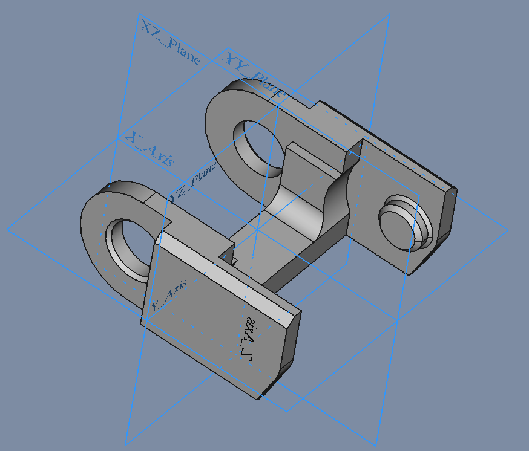

| File | Link |
| ---  | ---  |
| FreeCAD | [DragChainTop_22.5.FCStd](../../FreeCad-files/DragChain/DragChainTop_22.5.FCStd)|
| STL | [DragChainTop_22.5-Body.stl](../../FreeCad-files/DragChain/stl/DragChainTop_22.5-Body.stl) |

### 1. Sketch

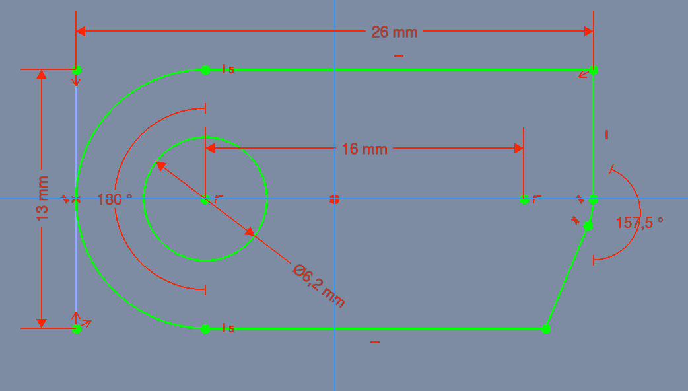

* Sketch
  * Support: XZ_Plane
  * Attachment Offset
    * Position: (x: 0,00 mm, y: 0,00 mm, z: 0,00 mm)

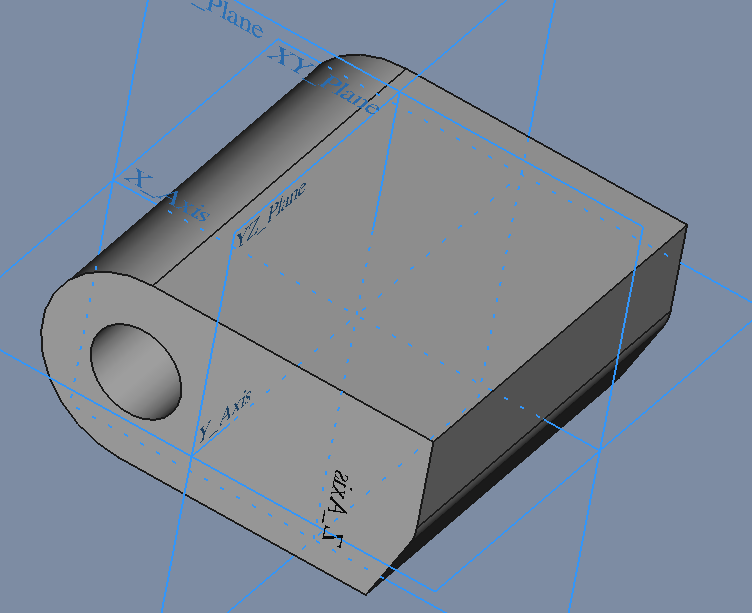

* Pad
  * Type: Length
    * Length 26,00 mm
  * Midplane: true
  * Reversed: false

### 2. Sketch001

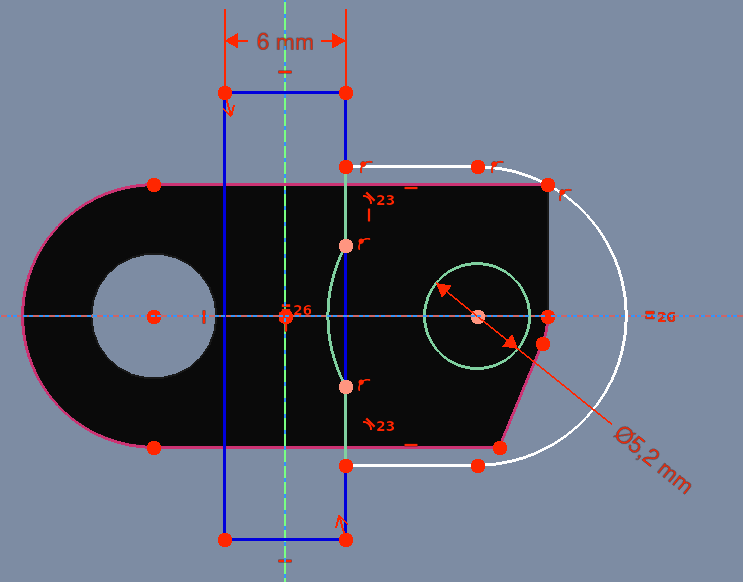

* Sketch
  * Support: XZ_Plane
  * Attachment Offset
    * Position: (x: 0,00 mm, y: 0,00 mm, z: 0,00 mm)

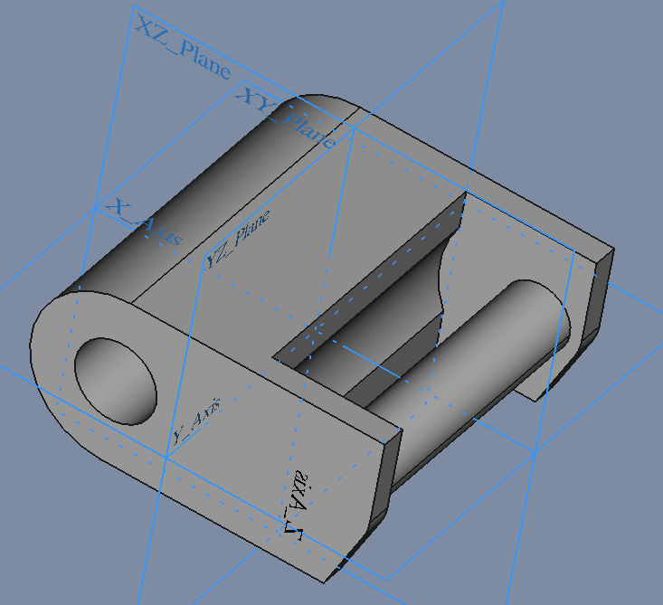

* Pocket
  * Type: Length
  * Midplane: true
  * Reversed: false

### 3. Sketch002

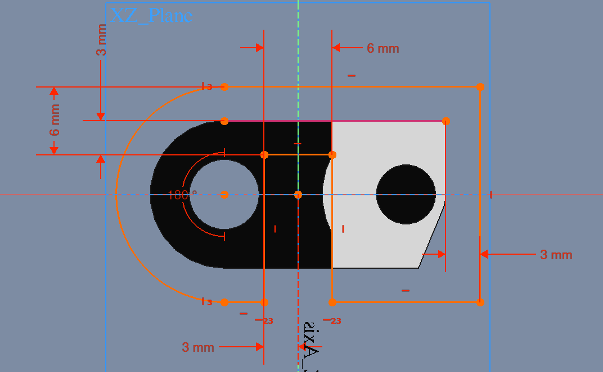

* Sketch
  * Support: XZ_Plane
  * Attachment Offset
    * Position: (x: 0,00 mm, y: 0,00 mm, z: 0,00 mm)

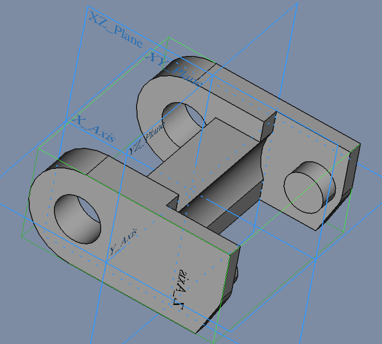

* Pocket
  * Type: Length
  * Midplane: true
  * Reversed: false

### 4. Sketch003

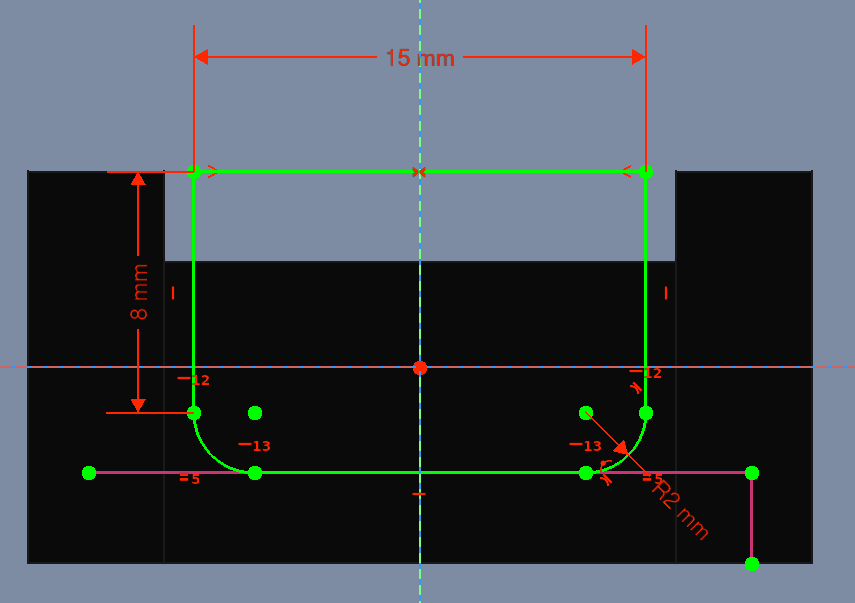

* Sketch
  * Support: YZ_Plane
  * Attachment Offset
    * Position: (x: 0,00 mm, y: 0,00 mm, z: 0,00 mm)

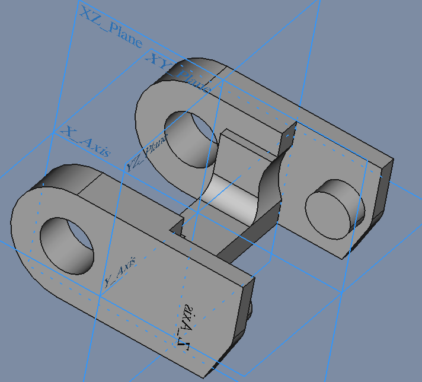

* Pocket
  * Type: ThroughAll
  * Midplane: true
  * Reversed: false

### 5. Sketch004

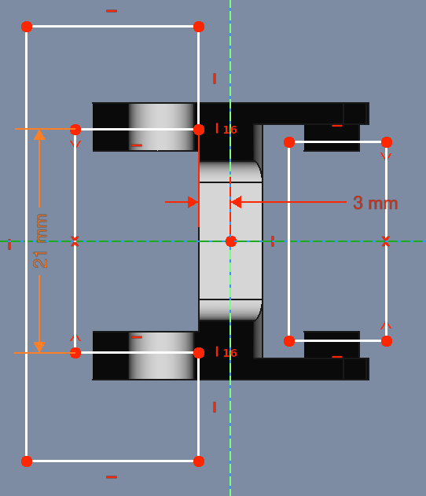

* Sketch
  * Support: XY_Plane
  * Attachment Offset
    * Position: (x: 0,00 mm, y: 0,00 mm, z: 0,00 mm)

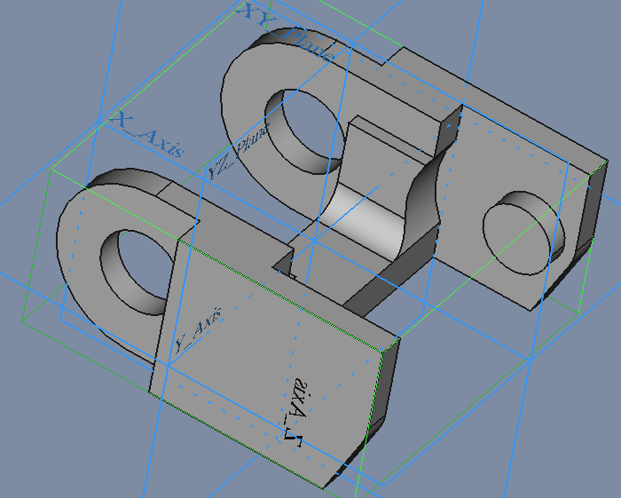

* Pocket
  * Type: ThroughAll
  * Midplane: true
  * Reversed: false
