# DragChain Basic

## Slut Resultat

| Basic | Basic A 22,5° | Basic B 22,5° |
| ---   | ---           | ---           |
|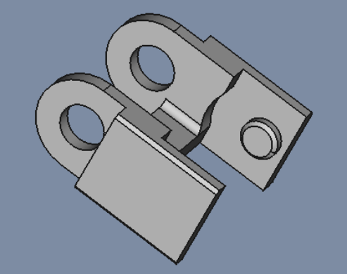|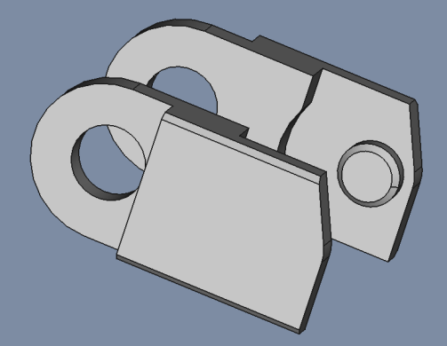|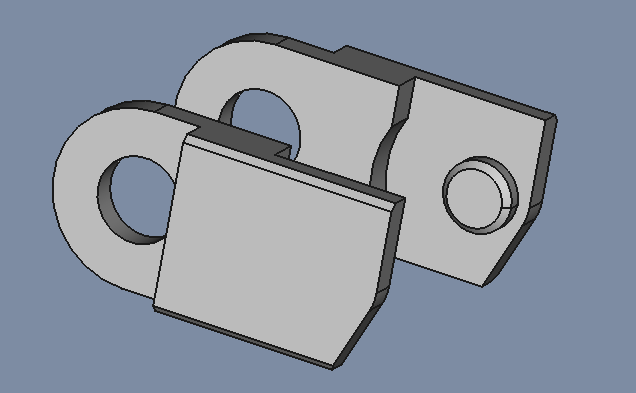|

| File   | Basic | Basic A 22,5° | Basic B 22,5° |
| ---    | ---   | ---           | ---           |
|FreeCAD |[DragChainBasic.FCStd](../../FreeCad-files/DragChain/DragChainBasic_22.5.FCStd)|[DragChainBasicA.FCStd](../../FreeCad-files/DragChain/DragChainA_22.5.FCStd)|[DragChainBasicB.FCStd](../../FreeCad-files/DragChain/DragChainB_22.5.FCStd)|
| STL    ||[DragChainBasicA.stl](../../FreeCad-files/DragChain/stl/DragChain_22.5_A.stl)|[DragChainBasicB.stl](../../FreeCad-files/DragChain/stl/DragChain_22.5_B.stl)|

## Sketch

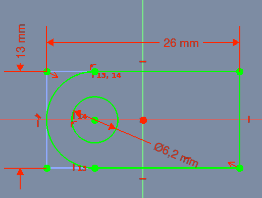

* Sketch
  * Support: XZ_Plane
  * Map Mode: FlatFace
  * Map Reversed: false
  * Attachment Offset
    * Angle: 0,00°
    * Axis: [X: 0,00 Y: 0,00 z: 1,00]
    * Position: (x: 0,00 mm, y: 0,00 mm, z: 0,00 mm)

### Pad

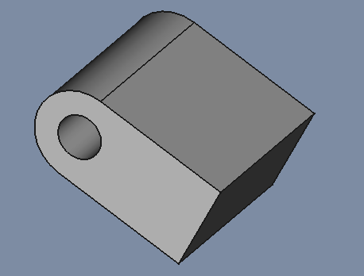

* Pad
  * Type: Length
    * Length: 26,00 mm
    * Midplane: true
    * Reversed: false
    * Alow Multi Face: true

## Sketch001

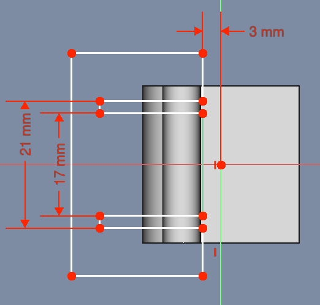

* Sketch
  * Support: XZ_Plane
  * Map Mode: FlatFace
  * Map Reversed: false
  * Attachment Offset
    * Angle: 0,00°
    * Axis: [X: 0,00 Y: 0,00 z: 1,00]
    * Position: (x: 0,00 mm, y: 0,00 mm, z: 0,00 mm)

### Pocket

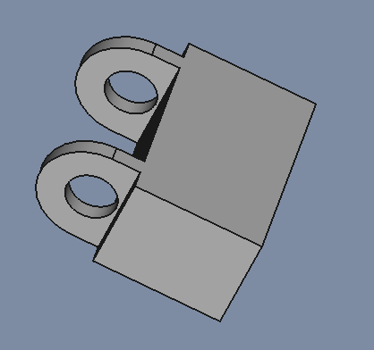

* Pocket
  * Type: ThroughAll
  * Midplane: true
  * Reversed: false
  * Alow Multi Face: true

## Sketch002

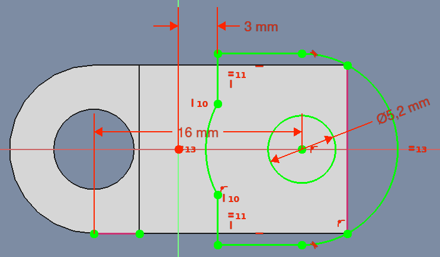

* Sketch
  * Support: XZ_Plane
  * Map Mode: FlatFace
  * Map Reversed: false
  * Attachment Offset
    * Angle: 0,00°
    * Axis: [X: 0,00 Y: 0,00 z: 1,00]
    * Position: (x: 0,00 mm, y: 0,00 mm, z: 0,00 mm)

### Pocket001

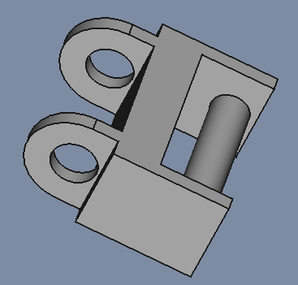

* Pocket
  * Type: Length: 22,00 mm
  * Midplane: true
  * Reversed: false
  * Alow Multi Face: true

## Sketch003

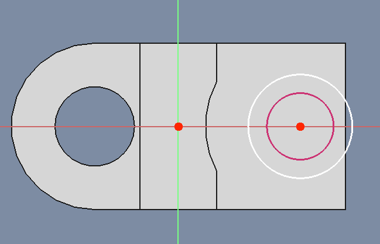

* Sketch
  * Support: XZ_Plane
  * Map Mode: FlatFace
  * Map Reversed: false
  * Attachment Offset
    * Angle: 0,00°
    * Axis: [X: 0,00 Y: 0,00 z: 1,00]
    * Position: (x: 0,00 mm, y: 0,00 mm, z: 0,00 mm)

### Pocket002

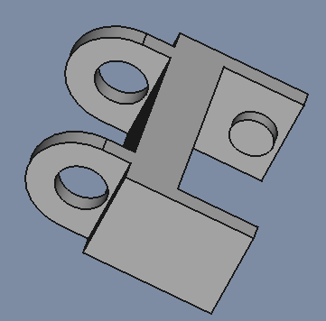

* Pocket
  * Type: Length: 19,00 mm
  * Midplane: true
  * Reversed: false
  * Alow Multi Face: true

## Sketch004

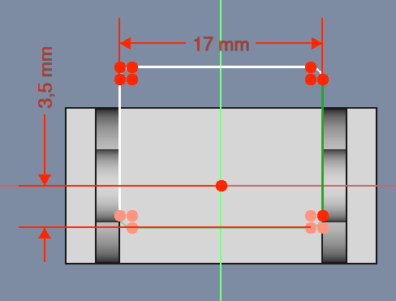

* Sketch
  * Support: YZ_Plane
  * Map Mode: FlatFace
  * Map Reversed: false
  * Attachment Offset
    * Angle: 0,00°
    * Axis: [X: 0,00 Y: 0,00 z: 1,00]
    * Position: (x: 0,00 mm, y: 0,00 mm, z: 0,00 mm)

### Pocket003

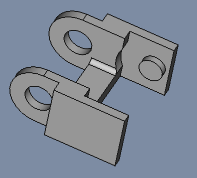

* Pocket
  * Type: ThroughAll
  * Midplane: true
  * Reversed: false
  * Alow Multi Face: true

## Chamfer

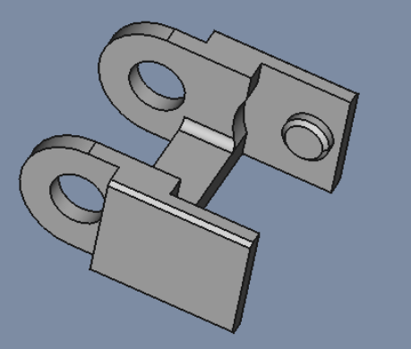

* Chamfer
  * Chamfer Type: Equal distance
  * Size: 0,50 mm
  * Angle: 45° 

# DragChain Basic Model A 22,5°

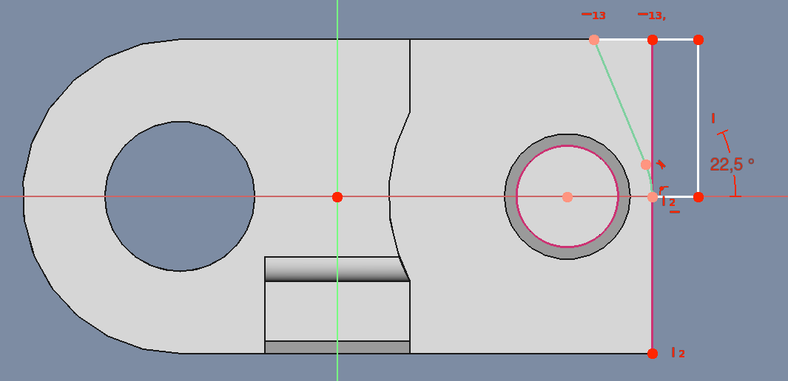

* Sketch
  * Support: XZ_Plane
  * Map Mode: FlatFace
  * Map Reversed: false
  * Attachment Offset
    * Angle: 0,00°
    * Axis: [X: 0,00 Y: 0,00 z: 1,00]
    * Position: (x: 0,00 mm, y: 0,00 mm, z: 0,00 mm)

### Pocket004A

* Pocket
  * Type: ThroughAll
  * Midplane: true
  * Reversed: false
  * Alow Multi Face: true

# DragChain Basic Model B 22,5°

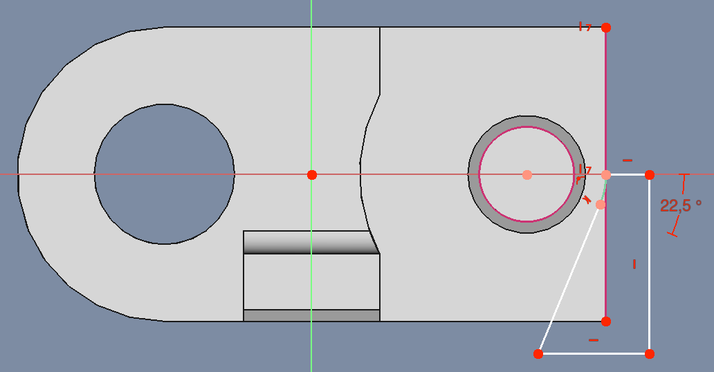

* Sketch
  * Support: XZ_Plane
  * Map Mode: FlatFace
  * Map Reversed: false
  * Attachment Offset
    * Angle: 0,00°
    * Axis: [X: 0,00 Y: 0,00 z: 1,00]
    * Position: (x: 0,00 mm, y: 0,00 mm, z: 0,00 mm)

### Pocket004A

* Pocket
  * Type: ThroughAll
  * Midplane: true
  * Reversed: false
  * Alow Multi Face: true

