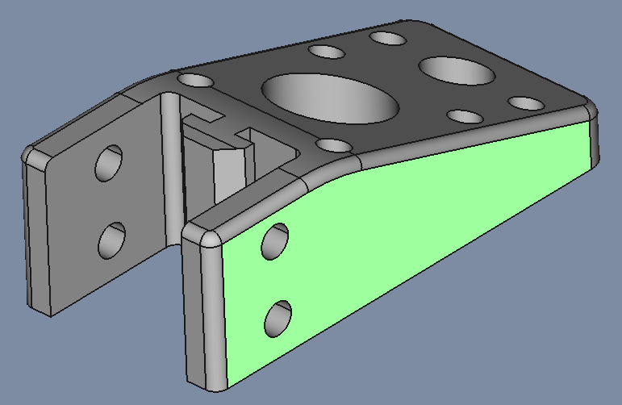
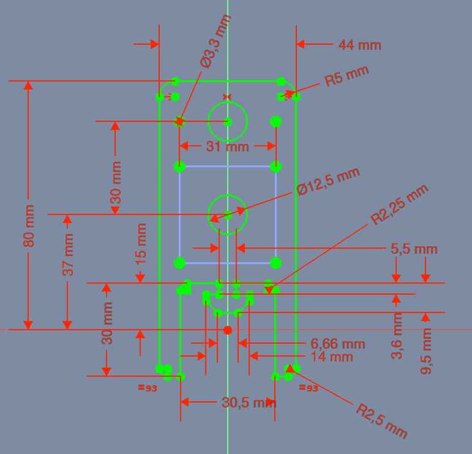
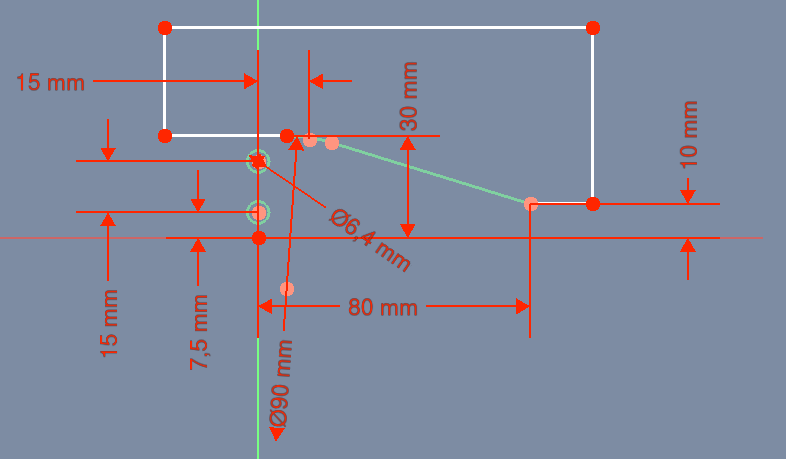
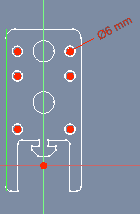
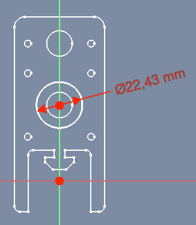

# BallBearingAndStepperMotor

## Slut Resultat

## 1. Sketch

* Sketch
  * Support: XY_Plane
  * Attachment Offset
    * Position
      * x: 0,00 mm
      * y: 0,00 mm
      * z: 0,00 mm
* Pad
  * Type: Length
    * Length 30,00 mm

## 2. Sketch

* Sketch
  * Support: XY_Plane
  * Attachment Offset
    * Position
      * x: 0,00 mm
      * y: 0,00 mm
      * z: 0,00 mm
* Pocket
  * Type: ThroughAll
  * Midplane: true
  * Reversed: false

## 3. Sketch

* Sketch
  * Support: XY_Plane
  * Attachment Offset
    * Position
      * x: 0,00 mm
      * y: 0,00 mm
      * z: 4,00 mm
* Pocket
  * Type: ThroughAll
  * Midplane: false
  * Reversed: true

## 4. Sketch

## 5. Sketch

